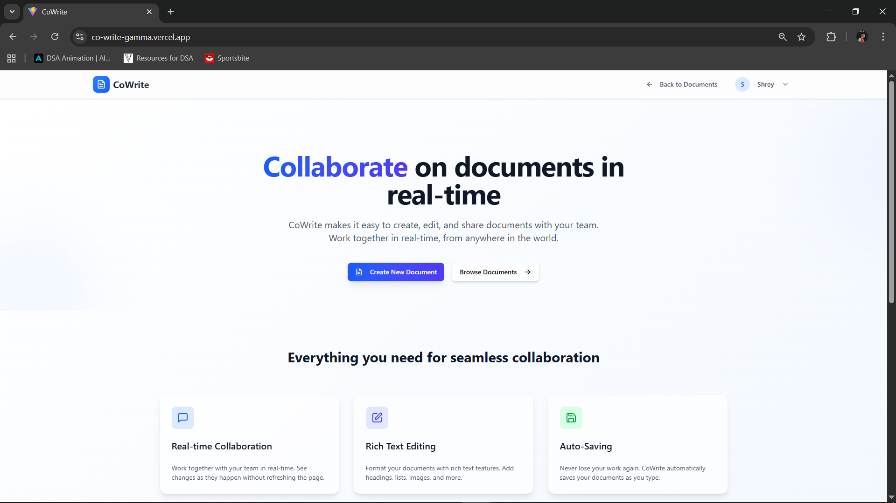
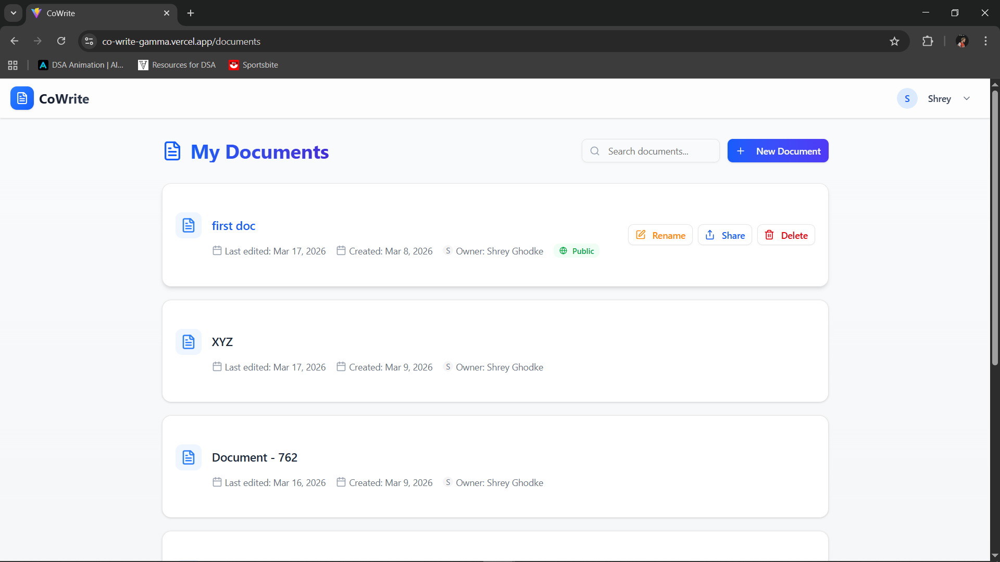
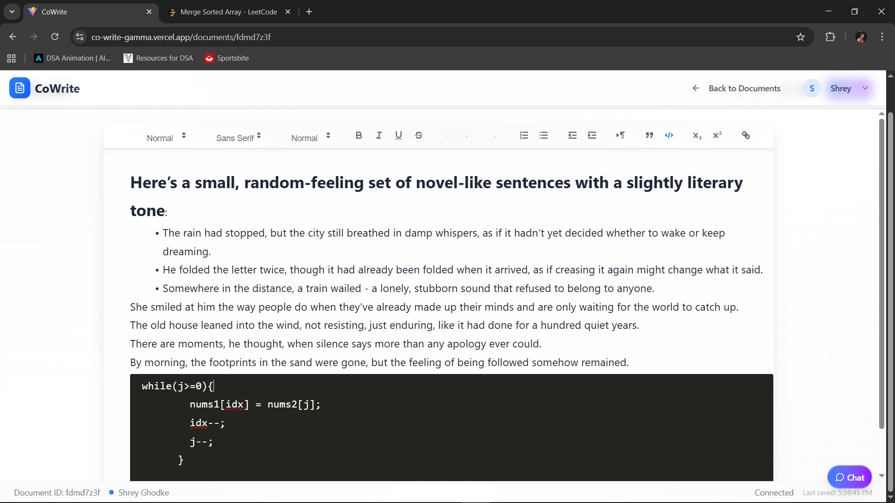
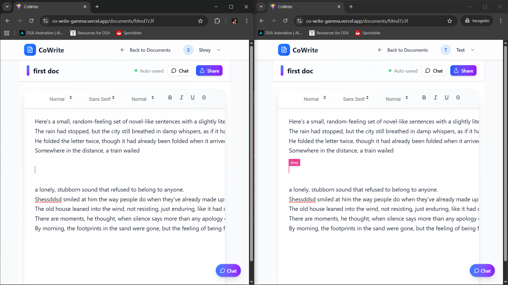
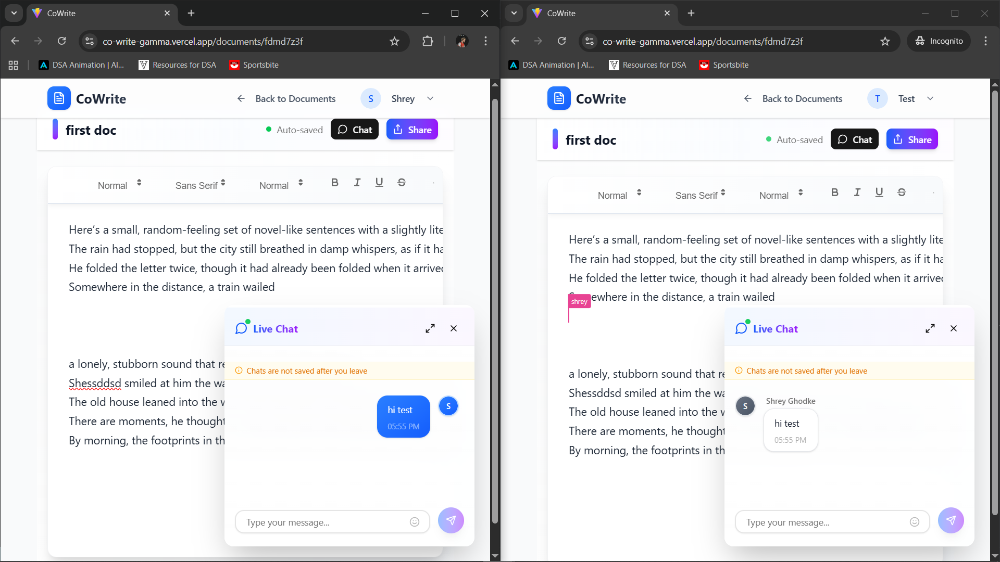
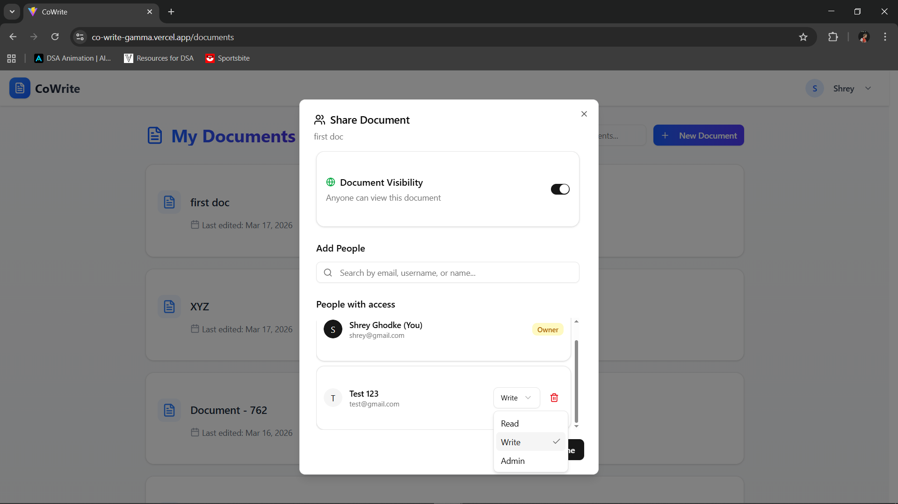

<div align="center">
  
# 📝 CoWrite
  
  ### A modern real-time collaborative document editor with live chat
  
  [](https://opensource.org/licenses/MIT)
  [](https://nodejs.org/)
  [](https://www.mongodb.com/)
  [](https://react.dev/)
  [](https://www.typescriptlang.org/)
  [](https://socket.io/)
  [](https://ui.shadcn.com/)

</div>

## ✨ Features

- **Real-time collaboration** - Multiple users can edit documents simultaneously with live cursors
- **Live chat system** - Built-in chat panel for real-time team communication
- **Rich text editing** - Comprehensive text formatting with Quill.js editor
- **Modern UI/UX** - Beautiful interface built with shadcn/ui components
- **Document sharing** - Advanced sharing modal with permission management
- **User authentication** - Secure login and registration system
- **Auto-saving** - Intelligent auto-save with visual indicators
- **Responsive design** - Fully responsive across all devices
- **TypeScript** - Full type safety for better development experience
- **Dark/Light themes** - Optimized for light mode with beautiful gradients

## 🖥️ Screenshots

<div align="center">
  
  <p><em>Home page</em></p>

  
  <p><em>Browse your documents</em></p>

  
  <p><em>Rich text editor</em></p>

  
  <p><em>Real-time collaboration</em></p>

  
  <p><em>Live chat while editing</em></p>

  
  <p><em>Share documents & manage access</em></p>

</div>

## 🛠️ Tech Stack

### Frontend (cowrite-frontend)

- **React 19** - Modern UI library with hooks
- **TypeScript** - Type-safe development
- **Vite** - Fast build tool and dev server
- **React Router** - Client-side routing
- **Quill.js** - Rich text editor with full-screen support
- **Socket.io Client** - Real-time communication
- **shadcn/ui** - Modern component library
- **Tailwind CSS** - Utility-first CSS framework
- **Lucide React** - Beautiful icon library
- **Axios** - HTTP client for API requests

### Backend

- **Node.js** - JavaScript runtime
- **Express** - Minimal web framework
- **Socket.io** - WebSocket communication for real-time features
- **MongoDB** - NoSQL database
- **Mongoose** - Elegant MongoDB object modeling
- **JWT** - Secure authentication tokens
- **bcrypt** - Password hashing

### UI Components

- **shadcn/ui Components Used:**
  - Button, Input, Card, Avatar, Badge
  - Dialog, Alert, Skeleton
  - Custom modals and panels
- **Custom Components:**
  - ChatPanel with real-time messaging
  - ShareModal with advanced permissions
  - AuthModal with login/register forms
  - Enhanced TextEditor with editable titles

## 🏗️ Architecture

CoWrite follows a modern client-server architecture with real-time capabilities:

1. **Frontend (React + TypeScript)**: 
   - Component-based architecture with shadcn/ui
   - Real-time document synchronization
   - Live chat system with typing indicators
   - Responsive design with beautiful animations

2. **Backend (Node.js + Express)**: 
   - RESTful API for document management
   - Socket.io for real-time collaboration and chat
   - JWT authentication system
   - MongoDB integration with Mongoose

3. **Database (MongoDB)**: 
   - Document storage with version control
   - User management and authentication
   - Chat message persistence

4. **Real-time Features**:
   - Document collaboration with operational transforms
   - Live chat with message deduplication
   - Typing indicators and user presence
   - Auto-save with visual feedback

## 🎨 Key Features in Detail

### 💬 Live Chat System
- Real-time messaging during document editing
- Expandable/minimizable chat panel
- Typing indicators and unread message badges
- Message grouping and timestamps
- Professional UI with smooth animations

### 📝 Enhanced Text Editor
- Full-screen editing experience
- Editable document titles in header
- Rich formatting toolbar with enhanced styling
- Auto-save with visual indicators
- Beautiful light theme with gradients

### 🤝 Advanced Sharing
- Share modal with copy-to-clipboard
- Permission management system
- Public/private document settings
- Collaboration user list

### 🎯 Modern UI/UX
- Built with shadcn/ui component library
- Responsive design for all screen sizes
- Beautiful gradients and animations
- Professional color scheme and typography
- Custom scrollbars and hover effects

## 🚀 Getting Started

### Prerequisites

- Node.js (v20+ recommended)
- MongoDB (local/Atlas) **or** Docker (recommended for local MongoDB)
- npm or yarn
- (Optional) Docker Desktop (for Docker Compose workflow)

### Installation

1. Clone the repository:

   ```bash
   git clone https://github.com/bPavan16/cowrite.git
   cd cowrite
   ```

2. Install backend dependencies:

   ```bash
   cd backend
   npm install
   ```

3. Install frontend dependencies:

   ```bash
   cd ../cowrite-frontend
   npm install
   ```

4. Create a `.env` file in the backend directory:
   ```env
   PORT=3001
   MONGODB_URI=mongodb://localhost:27017/cowrite
   JWT_SECRET=your_jwt_secret_key_here
   NODE_ENV=development
   ```

### Running the Application

#### Option A: Docker (MongoDB + Backend)

From the repo root:

```bash
docker compose up --build
```

- MongoDB: `mongodb://localhost:27017`
- Backend API: `http://localhost:3001`

Then run the frontend locally:

```bash
cd cowrite-frontend
npm install
npm run dev
```

To stop:

```bash
docker compose down
```

#### Option B: Local (no Docker)

1. Start MongoDB server (if using local MongoDB)

2. Start the backend server:

   ```bash
   cd backend
   npm start
   ```

3. Start the frontend development server:

   ```bash
   cd cowrite-frontend
   npm run dev
   ```

4. Open your browser and navigate to `http://localhost:5173`

### Development Scripts

**Frontend (cowrite-frontend):**
```bash
npm run dev          # Start development server
npm run build        # Build for production
npm run preview      # Preview production build
npm run lint         # Run ESLint
```

**Backend:**
```bash
npm start            # Start production server
npm run dev          # Start with nodemon (development)
```

## 🔍 Usage

### Getting Started

1. **Register/Login**: Create an account or sign in to access your documents
2. **Create Documents**: Click "New Document" to start writing
3. **Real-time Editing**: Share the document URL with collaborators for live editing
4. **Live Chat**: Use the chat panel to communicate while editing

### Document Features

- **Editable Titles**: Click on the document title in the header to rename
- **Auto-save**: Changes are automatically saved with visual indicators
- **Rich Formatting**: Use the toolbar for text styling, lists, links, and more
- **Full-screen Editing**: Distraction-free writing experience

### Collaboration Features

- **Real-time Sync**: See changes from other users instantly
- **Live Chat**: Built-in chat panel for team communication
- **Typing Indicators**: See when others are typing
- **User Presence**: View who's currently editing the document

### Sharing Documents

1. Click the "Share" button in the document header
2. Copy the document link to share with collaborators
3. Manage permissions and visibility settings
4. View active collaborators in the sharing modal

## 🔌 Socket.io Events

### Document Events
- `get-document` - Load document content
- `save-document` - Save document changes
- `send-changes` - Broadcast text changes
- `receive-changes` - Receive text changes

### Chat Events
- `send-chat-message` - Send a chat message
- `receive-chat-message` - Receive chat messages
- `user-typing` - Broadcast typing status
- `user-typing-status` - Receive typing indicators

## 📡 API Endpoints

### Authentication
- `POST /api/auth/register` - Register a new user
- `POST /api/auth/login` - User login
- `GET /api/auth/verify` - Verify JWT token

### Documents
- `GET /api/documents` - Get all user documents
- `GET /api/documents/:id` - Get a specific document
- `POST /api/documents` - Create a new document
- `PATCH /api/documents/:id/title` - Update document title
- `DELETE /api/documents/:id` - Delete a document
- `POST /api/documents/:id/share` - Share document settings

### Users
- `GET /api/users/profile` - Get user profile
- `PATCH /api/users/profile` - Update user profile

## 🎯 Project Structure

```
.
├── .github/
│   └── workflows/            # CI workflows
├── backend/                 # Node.js backend
│   ├── src/
│   │   ├── config/         # Database configuration
│   │   ├── middleware/     # Express/Socket middleware
│   │   ├── models/         # Mongoose models
│   │   ├── routes/         # API routes
│   │   ├── utils/          # Utility functions
│   │   └── server.js       # Main server file
│   └── package.json
├── cowrite-frontend/        # React TypeScript frontend
│   ├── src/
│   │   ├── components/     # Reusable components
│   │   │   ├── ui/         # shadcn/ui components
│   │   │   ├── auth/       # Authentication components
│   │   │   ├── chat/       # Chat system components
│   │   │   └── sharing/    # Document sharing components
│   │   ├── contexts/       # React context providers
│   │   ├── pages/          # Page components
│   │   ├── hooks/          # Custom React hooks
│   │   ├── lib/            # Utility libraries
│   │   └── main.tsx        # App entry point
│   ├── components.json     # shadcn/ui config
│   ├── tailwind.config.js  # Tailwind configuration
│   └── package.json
├── documentation/           # Deep-dive docs (architecture, sockets, editor)
├── images/                  # Screenshot assets
├── docker-compose.yaml      # Local MongoDB + backend stack
└── README.md
```

## 🤝 Contributing

Contributions are welcome! Please feel free to submit a Pull Request.

1. Fork the repository
2. Create your feature branch (`git checkout -b feature/amazing-feature`)
3. Commit your changes (`git commit -m 'Add some amazing feature'`)
4. Push to the branch (`git push origin feature/amazing-feature`)
5. Open a Pull Request

## 📄 License

This project is licensed under the MIT License - see the LICENSE file for details.

## 🙏 Acknowledgements

- [Quill.js](https://quilljs.com/) - Rich text editor with excellent API
- [Socket.io](https://socket.io/) - Real-time bidirectional communication
- [shadcn/ui](https://ui.shadcn.com/) - Beautiful and accessible component library
- [Tailwind CSS](https://tailwindcss.com/) - Utility-first CSS framework
- [Lucide React](https://lucide.dev/) - Beautiful & consistent icon library
- [React](https://reactjs.org/) - JavaScript library for building user interfaces
- [TypeScript](https://www.typescriptlang.org/) - Typed superset of JavaScript
- [Vite](https://vitejs.dev/) - Fast build tool and development server


